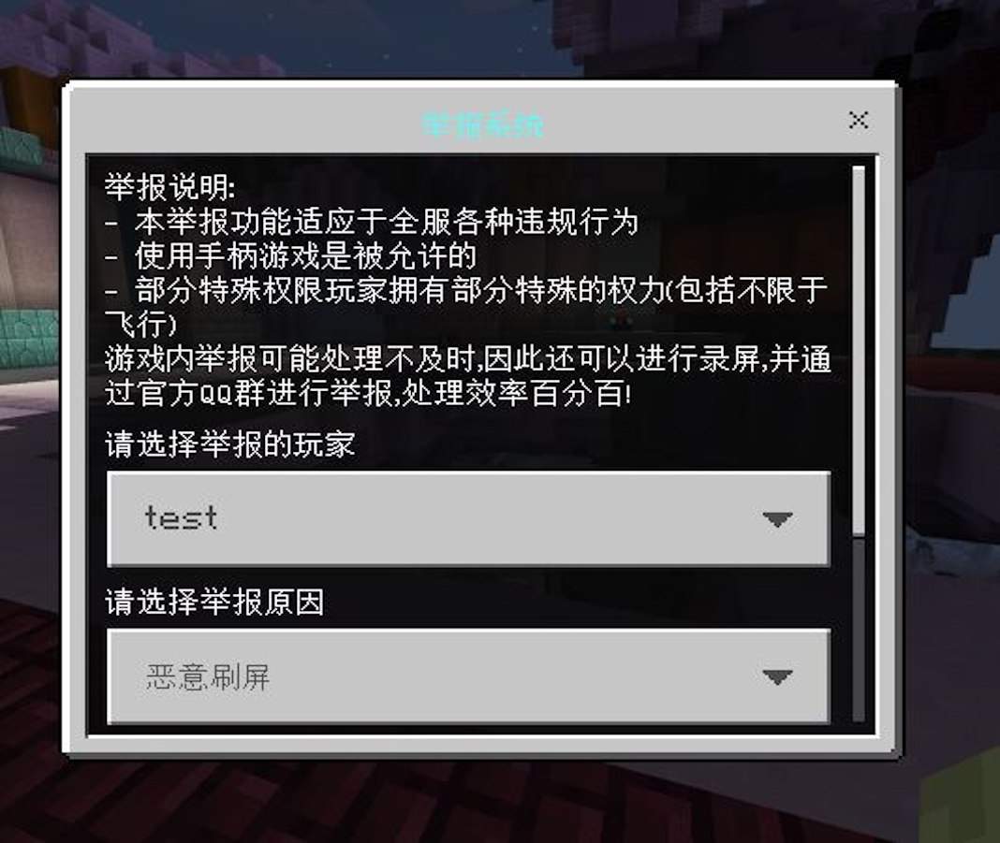
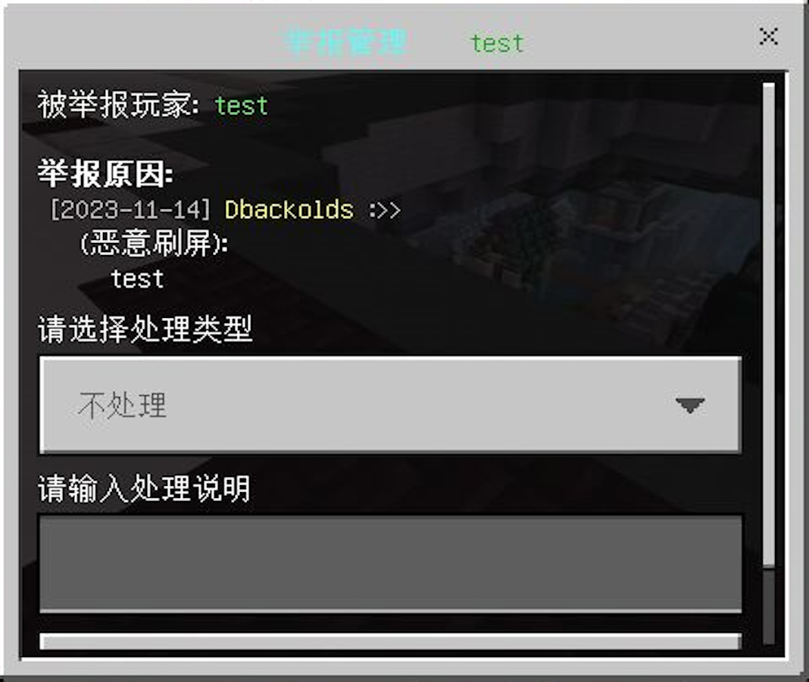
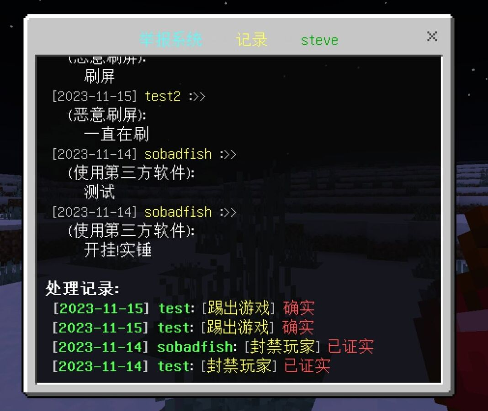
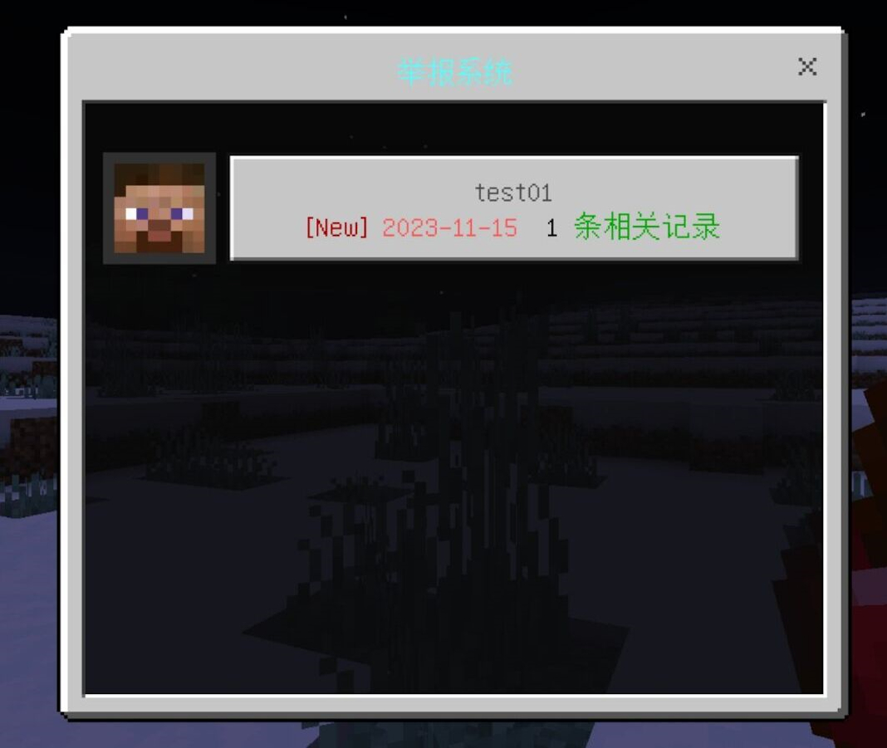

# 
Report举报系统
  

------
 

### :zap: Depends

#### MySQL 5.6
MySQL数据库管理系统版本5.6。

#### EasyMySQL

[下载](https://motci.cn/view/SmallasWater/job/EasyMySQL/job/master/))

### ⚠️Server

| 核心           |         是否支持         |
|--------------|:--------------------:|
| NukkitX      |          ✅           |
| PowerNukkitX |          ✅           |
| Nukkit-PM1E  |          ✅           |
| Nukkit-MOT   |          ✅           |

### 📝Function
|     |    功能     |
|:---:|:---------:|
|  ✅  | 自定义举报内容  |
|  ✅  | 可增加协管协作处理  |
|  ✅  | 可查看历史举报信息 |
|  ✅  |  自定义举报惩罚   |
|  ✅  |   记录举报时间与次数    |

### ✋How to use
* 玩家执行/rp 即可举报在线玩家 当玩家不在线时执行/rp r <玩家> 进行举报
* 管理员需要执行/rp a查看举报信息
* 如需查看历史举报记录执行/rp h <玩家>
* 设置协管执行 /rp p <玩家> 即可设置

###  📄DownLoad
[下载](https://motci.cn/view/SoBadFish/job/Report/)

### 👀Display

|    |    |
|----------------------|----------------------|
|    |    |
